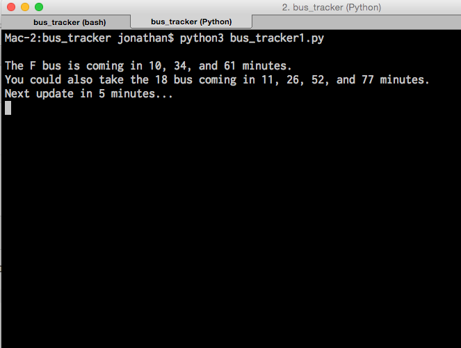

# Bus Notifier Tool
Very simple example of using the NextBus / RestBus API for personal bus time prediction read-outs.

- Uses NextBus / RestBus for bus time predictions
- Uses Mac OS X 'say' command for spoken text

